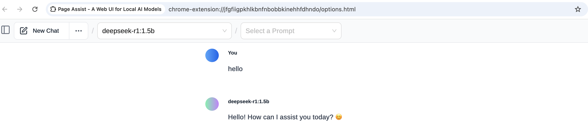

# LLM Cloud Deployment

In this project, we could deploy an LLM model (choose deepseek-r1:8b right here) on AWS cloud and chat with LLM on local through `terraform`

Tools need:
```txt
1. VPC (public/private subnets, route tables, NAT gateway, IGW, )
2. IAM
3. EKS (auto mode)
4. ollama (we would pull ollama image down into pod and download LLM model through ollama)

Local:
1. kubectl
2. terraform

3rd app
1. page assist (chrome plugin, an LLM web UI)
```

1. We would use `EKS Auto Mode` right here. EKS Auto Mode extends AWS management of Kubernetes clusters beyond the cluster itself, to allow AWS to also set up and manage the infrastructure that enables the smooth operation of your workloads.

2. We choose use `ollama` to deploy and use LLM here. Ollama offers an unparalleled solution for deploying and managing LLMs locally. Details could be found in [deployment.yaml](eks/manifests/deployment.yaml).

3. When Ollama starts, it automatically detects the available GPUs in your system. By default, EKS Auto Mode default nodepools do not support enable GPUs.
The default nodepool support [`m`,`r`,`c` ec2 families](https://docs.aws.amazon.com/eks/latest/userguide/set-builtin-node-pools.html). In EKS Auto Mode, we should only use nodepools instead of nodegroups, so we could define a custom [nodeclass.yaml](eks/manifests/nodeclass.yaml) and [nodepool.yaml](eks/manifests/nodepool.yaml) (CRD) to enable GPUs. 

---
---

## Init terraform
first we need to initilize a working directory containing Terraform configuration files.

1. change [state.config.example](state.config.example),remove the `.example` suffix and fullfill the needed variables.

2. run 
```sh
terraform init -backend-config="./state.config"
```
to init working directory

3. deploy the AWS services on cloud
```sh
# youcloud check the components first
terraform plan

terraform apply --auto-approve
```

4. Wait for the completion (once you see the output values)

---
---
## Deploy kubernetes manifests into eks auto mode cluster

1. update local kubectl config
```sh
aws eks --region ap-southeast-2 update-kubeconfig --name eks-auto-demo
```

2. deploy all manifests into eks cluster
```sh
kubectl apply -f nodeclass.yaml
kubectl apply -f nodepool.yaml
kubectl apply -f namespace.yaml
kubectl apply -f storage-class.yaml
kubectl apply -f pvc.yaml
kubectl apply -f deployment.yaml
kubectl apply -f service.yaml
kubectl apply -f ingressclass.yaml
kubectl apply -f ingress.yaml
```

3. Get external url through ingress
```sh
kubectl get svc -n ollama
kubectl get ingress -n ollama
```
you would see the external url like 
```
k8s-ollama-ollamain-xxxxxxxxxxxxxxxxxxxxx.ap-southeast-2.elb.amazonaws.com
```

---
---
## LLM Dialogue
once get the url, we could use it to chat with model

1. through `terminal`:
```sh
curl -X POST k8s-ollama-ollamain-xxxxxxxxxxxxxxxxxxxxx.ap-southeast-2.elb.amazonaws.com/api/generate -d '{
  "model": "deepseek-r1:8b",
  "prompt": "Hello, how are you?",
  "stream": false
}' | jq -r '.response'
```

2. Or could chat with llm through `Page Assist`


---
---
## Source clean

```sh
kubectl delete all --all -n ollama

or destroy terraform resource directly

terraform destroy
```
