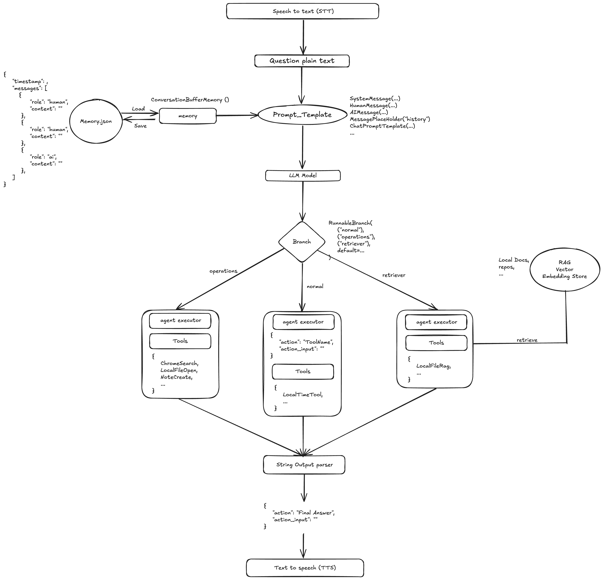

# LittleSeven - Personal Local AI Assistant

This project is for a local AI Assistant solution based on langchain and OpenAI.

### **What Can It Do?**
1. **General Chatting** – Converse naturally.
2. **Real-time Information** – Provide up-to-date info (e.g., current time).
3. **Local Operations** – Open software, search, and access files/folders.
4. **Local Knowledge Retrieval (RAG)** – Answer based on your local documents.
5. **Note-taking** – Create file, highlight and record key information on request.
6. **Text & Voice Input Support** – Type or speak, and the assistant will respond by voice.





---
## Demo

<video width="640" height="360" controls>
  <source src="./images/demo.mp4" type="video/mp4">
  Your browser does not support the video tag.
</video>

I provided a demo video to show how the AI assistant works in [demo.mp4](images)

---
## **LLM Integration**
This project primarily uses **OpenAI API** as the LLM provider.  
It also includes initial work for running **a fully local LLM (Llama3-7B)**, though not yet fully integrated.

For examples of usage, see:  
- **[langc](langc)**
- **[langc_agent](langc_agent)**

---

## **Memory & Storage**
- **Chat history** is stored **locally** in `memory.json` and persists for **24 hours**.
- **Cloud storage** option: See **[Firebase Integration](langc_memory_store/langc_store_memory_in_firebase.ipynb)**.


---

## **Configuration**
- Key parameters are defined in **[`config.py`](src/common/config.py)**.

---

## **How to Run**
Main source code is located in **[`src`](src)**.


Run: 

```sh
python ./src/main/LittleSeven-AI-Assistant.py
```

to wake up the AI Assistant. 

Type in What you want to say and type `Enter` or direct press `Enter` the system would accept your voice and convert to plain text for the assistant.

The assistant would voice reply.


---
**Example prompts**

Here are some input prompt:

1. Ask for current time:

```
User: What is current time now?
```

2. Ask to retrieve Local knowledge(RAG)

```
User: Could you explain ... with local knowledge?
```

3. Ask AI to operate your laptop.

```
User: Help me open webpage and google ...
User: Help me write a note ...
User: Do you know where ... on my laptop and open the file for me.
```

